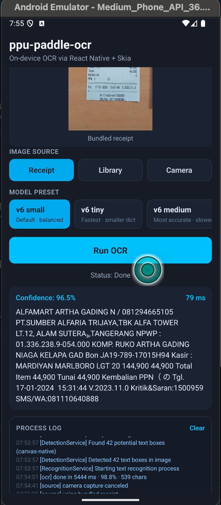

# ppu-paddle-ocr — React Native demo

An [Expo](https://expo.dev) app that runs the `ppu-paddle-ocr/mobile` OCR
pipeline fully on-device (iOS / Android). Pick an image — the bundled receipt,
one from the photo library, or a fresh camera capture — choose a model preset,
and recognize the text. The result (text, confidence, timing) can be copied as
JSON, and a live process log mirrors the recognition pipeline.

<p align="center">
  
</p>

## Requirements

`ppu-paddle-ocr/mobile` pulls in native modules (`onnxruntime-react-native`,
`@shopify/react-native-skia`), so this needs a **dev client or a prebuilt native
project — Expo Go will not work**.

- Node ≥ 18 and [Bun](https://bun.sh) (the repo is pinned with `bun.lock`)
- Xcode (iOS) and/or Android SDK + an emulator/device (Android)
- JDK 17 for the Android build
- Expo SDK 56 / React Native 0.85, New Architecture enabled (required by
  Reanimated 4 and Skia 2 — it cannot be turned off)

## Run

```bash
cd ppu-paddle-ocr-mobile-react-native-demo
bun install

# Build & launch on a running emulator/simulator or device.
# Prebuild runs automatically; the scripts already set the autolinking flag.
bun run android      # or: bun run ios
```

The first OCR run downloads the PP-OCRv6 small models over the network and
caches them for the session.

## Native setup notes

These are already wired into the repo — documented here because they are easy to
get wrong if you regenerate the native projects or bump versions.

- **Community autolinking is forced on.** `onnxruntime-react-native` is a legacy
  bridge module with no `codegenConfig`, and Expo's default autolinker only links
  New-Architecture modules — so it silently skips ONNX Runtime, leaving
  `NativeModules.Onnxruntime` null and crashing at startup with
  `Cannot read property 'install' of null`. The `android` / `ios` / `prebuild`
  scripts therefore set `EXPO_USE_COMMUNITY_AUTOLINKING=1`, which routes React
  Native modules through `@react-native-community/cli` (added as a devDependency)
  while Expo modules keep linking normally. `react-native.config.js` declares
  ONNX Runtime explicitly for that autolinker.
- **`react-native-worklets` is a direct dependency.** The community autolinker
  only links *direct* dependencies, and Reanimated 4 needs the worklets native
  library; Expo would have picked it up transitively.
- **`onnxruntime-react-native` is patched.** Its `android/build.gradle` calls
  `VersionNumber.parse(...)`, an internal Gradle API removed in Gradle 9. The
  patch in `patches/` swaps it for the package's own `REACT_NATIVE_MINOR_VERSION`
  check (applied automatically via `bun`'s `patchedDependencies`).

## How it works

```ts
import { PaddleOcrService } from "ppu-paddle-ocr/mobile";

const service = new PaddleOcrService();
await service.initialize();

const result = await service.recognize(imageBuffer, { flatten: true });
console.log(result.text, result.confidence);

await service.destroy();
```

- `src/hooks/useOcr.ts` — owns the service lifecycle and rebuilds it when the
  selected model preset changes; recognition runs on caller-supplied bytes.
- `src/hooks/useImageSource.ts` — resolves the bundled receipt, a library pick,
  or a camera capture (`expo-image-picker`) to an `ArrayBuffer`.
- `src/ocr/presets.ts` — the curated subset of the built-in model catalogue
  shown in the preset selector.
- `src/logging/logStore.ts` — mirrors `console` (including the library's
  `verbose` pipeline logs) into the on-screen Process log.
- `App.tsx` / `src/components/*` — source selector, model selector, preview,
  Run button, result card (with Copy JSON), and the log panel.

## Notes

- **CPU by default.** Pass `new PaddleOcrService({ session: { executionProviders: ["nnapi"] } })`
  on Android or `["coreml"]` on iOS to opt into hardware acceleration.
- **Smaller download.** Pass a lighter preset, e.g.
  `new PaddleOcrService({ model: V6_TINY_MODEL })`, if app-start latency matters
  more than accuracy.
